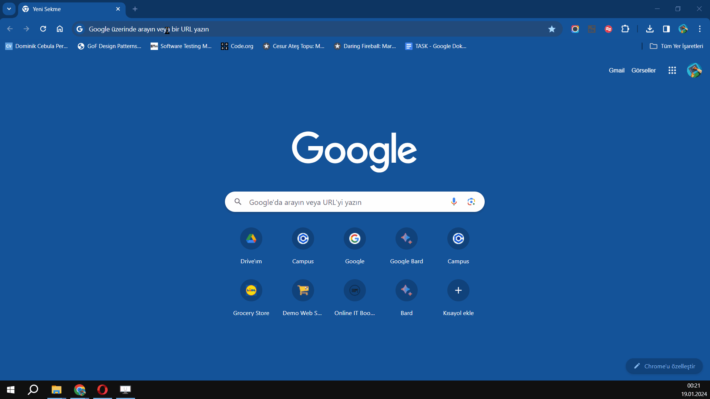
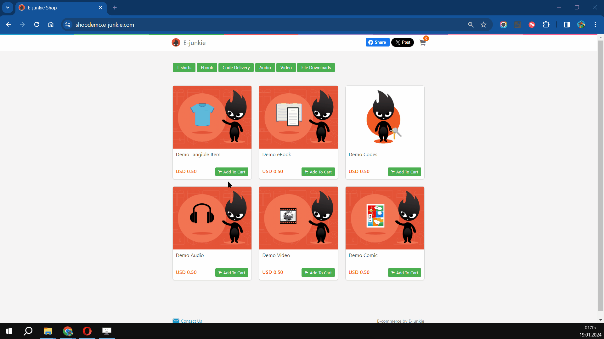
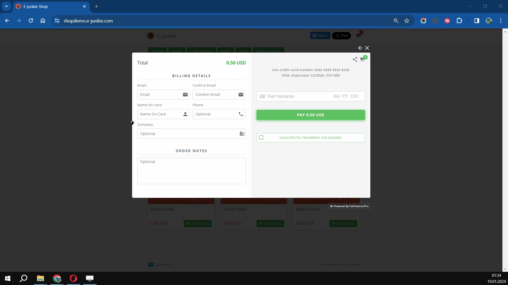
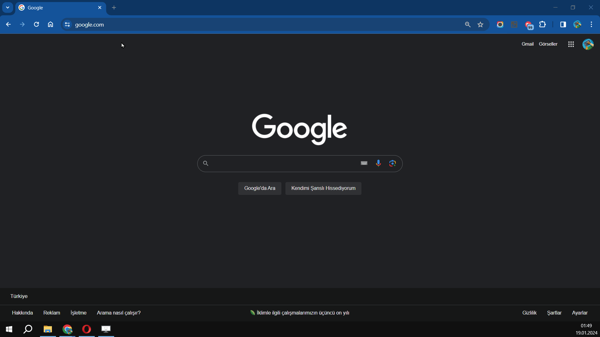
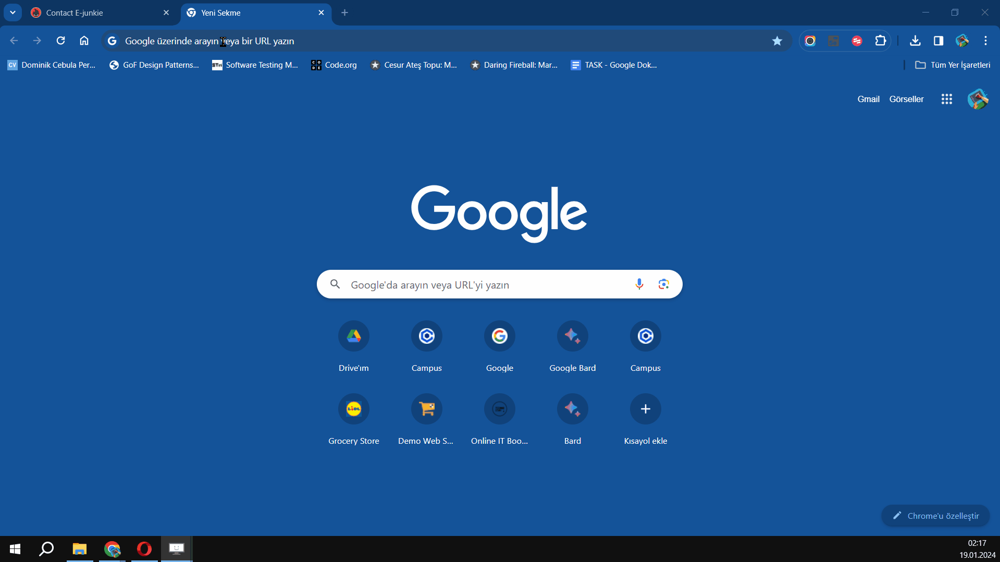
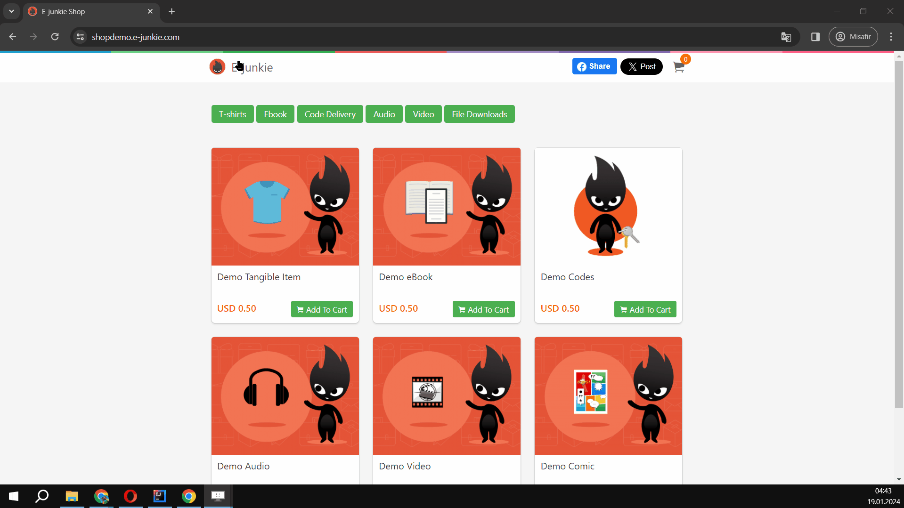
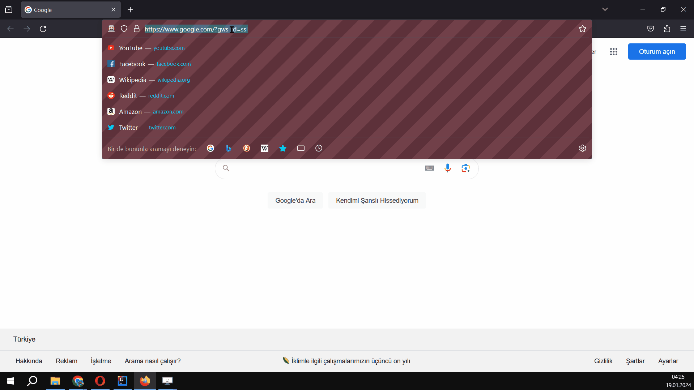

<h1 align="center">
  
</h1>

---

# 👩‍💻 E-Junkie Demo Site Testing Project

    

---

## 📚 Project Overview

This project tests the [E-Junkie Demo Site](https://shopdemo.e-junkie.com/) to ensure platform **reliability**, **functionality**, and **user experience**.  
We simulate **manual test cases** with positive and negative scenarios, aiming to achieve flawless e-commerce functionality.

---

## 🚀 Project Details

- **Sprint Duration:** 1 Week  
- **Primary Environment:** [Shop Demo](https://shopdemo.e-junkie.com/)  
- **Backup Environment:** [E-Junkie Wiki](https://e-junkie.com/wiki/demo/)

### 🧩 User Stories (US):

| Code  | Description                           |
|-------|---------------------------------------|
| US_301 | E-Book Cart Functionality Test         |
| US_302 | Incorrect Credit Card Payment Attempt |
| US_303 | Failed Payment Validation             |
| US_304 | Successful Payment with Debit/Credit  |
| US_305 | Payment Confirmation and Download     |
| US_306 | Sending a Contact Us Message          |
| US_307 | Homepage Navigation Test              |
| US_308 | Accessing Info Video                  |
| US_309 | (Optional) Detailed Download Validation |

---

## 🛠️ Technologies Used

| Technology    | Version / Info            |
|-------------- |---------------------------|
| ☕ JDK       | 17                        |
| 🌐 Selenium  | 4.x                       |
| 🧪 TestNG    | Latest Version            |
| 📂 GitHub    | Source Control            |
| 🗂️ Jira      | Project Management        |
| 🌍 Browsers  | Chrome, Firefox, Safari   |

---

## 📌 Contributors

| Name                                                       | Role               |
|------------------------------------------------------------|--------------------|
| [Diyar Ölmez](https://github.com/diyarolmezz)               | GitHub Manager     |
| [Gamze Batmaz](https://github.com/GAMZE3845)               | Jira Administrator |
| [Ebubekir Duvarcı](https://github.com/Ebubekir2025)        | Tester             |
| [Barış Saydam](https://github.com/BarisSaydam)             | Tester             |
| [Erdem Özkan](https://github.com/ErdemOzkann)              | Tester             |
| [Ömer Boncuk](https://github.com/palanque92)               | Tester             |
| [Atilla Toros Avcı](https://github.com/AtillaTorosAvci)    | Tester             |

---

## 📁 Evidence Files (Manual Testing)

### US_301 — Promo Code - Invalid Entry  
[View GIF](docs/US301_EJunkie_PromoCodeNegative.gif)  

### US_302 — Payment Failure with Invalid Card  
[View GIF](docs/US302_EJunkie_PayNegative.gif)  

### US_303 — Failed Payment Scenario  
[View GIF](docs/US303_EJunkie_PayNegative.gif)  

### US_304 — Successful Payment  
[View GIF](docs/US304_EJunkie_Pay.gif)  

### US_305 — Download Purchased E-Book  
[View GIF](docs/US305_EJunkie_Download.gif)  

### US_306 — Contact Form Submission  
[View GIF](docs/US306_EJunkie_ContactUs.gif)  

### US_307 — Site Navigation and Logo Access  
[View GIF](docs/US307_EJunkie_Logo.gif)  

### US_308 — Info Video on Homepage  
[View GIF](docs/US308_EJunkie_Youtube.gif)  

### US_309 — Download Details After Purchase  
[View GIF](docs/US309_EJunkie_DownloadDetails.gif)  

---

## 💬 Communication Platforms

- **RocketChat**
- **WhatsApp**

---

## ✨ Skills Highlighted

- Manual Testing 🔍 
- Functional UI Testing 🖥️  
- Bug Reporting 🐞  
- Agile Sprint Workflow 📈  
- Git & GitHub Collaboration 🔧  
- Negative Testing Scenarios ⚡  
- Test Documentation ✍️

---

📌 Note: This project is for educational and testing purposes only.
